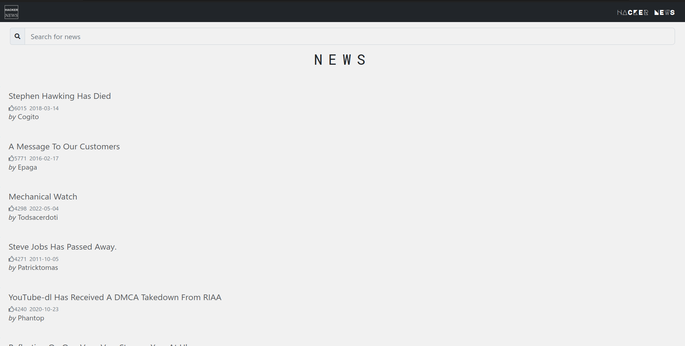
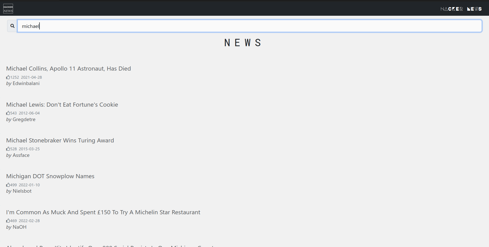
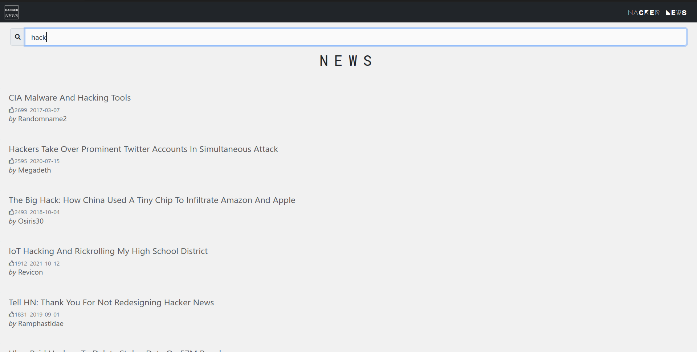
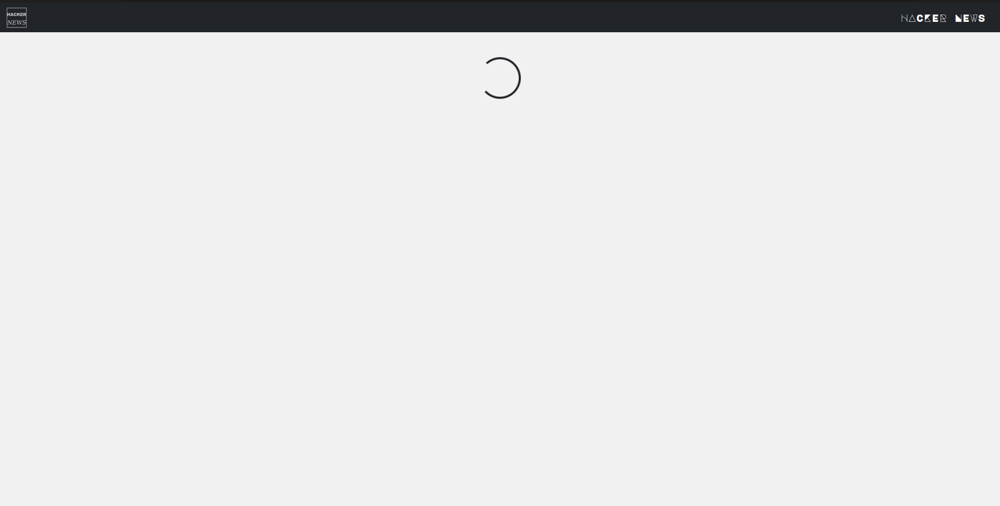
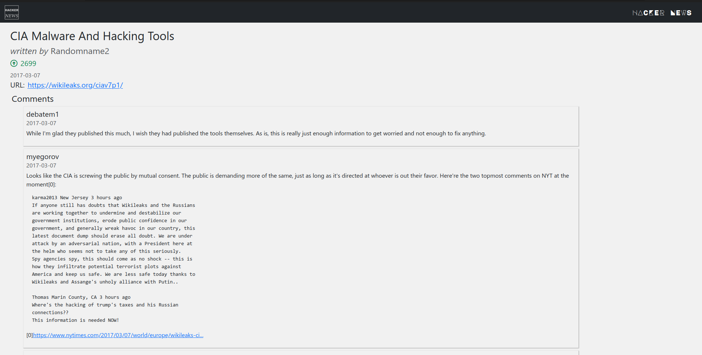

React web app to search and display Hacker News using hn.agnolia.com SEARCH API.

Running the app:
```
$npm i
$npm start
```

1. Home Page


2. Searching



3. Loading Screen


4. Details Page

